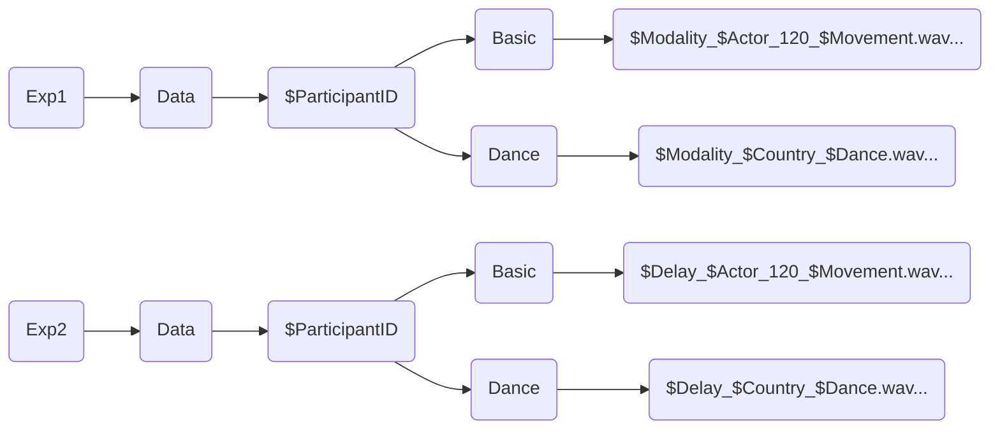

## Introduction
Analysis process used on data collected for the MuMo Stimuli set validation.

## Data Structure
Data is made up of one stereo recording for each trial made by the participant. The right channel contains the microphone's recording of participant's response, the left channels contains  the computer's audio, recorderd through an hardware feedback loop.

The data folder is structured as follows:


## Extraction Script
The first part of the analysis consisted in the extraction of participant's claps. This was not a trivial task, since participants were quite varied in their volume and relationship with the stimulus' periodicity.

### Proper Extraction
The proper extraction of claps was done through the <code>findpeaks()</code> function in Matlab. 
Before that a (somewhat haphazard) compression was applied to the response's channel:
```matlab
    noiseFloor    = 0.001; 
    comprThreshold= 0.2;
    comprGain     = 100;
    threshold     = 0.005;
    minInterval   = 0.1;

    responseChannel(abs(responseChannel) < noiseFloor) = 0; 
    low_idx2 = abs(responseChannel) < comprThreshold;
    responseChannel(low_idx2) = responseChannel(low_idx2) * comprGain;
    responseChannel = responseChannel * (0.9 / max(abs(responseChannel)));
```

After this, the actual extraction was performed:
```matlab
    min_pk_dist = fs*0.05; %50 ms
    min_pk_prom = 0.03;
    min_pk_height = 0.025;

    %Find peaks response
    [peak_amp, locs] = findpeaks(responseChannel, ...
        'MinPeakDistance', min_pk_dist, ... 
        'MinPeakProminence', min_pk_prom, ...
        'MinPeakHeight', min_pk_height); 
    locs = round(locs/fs*1000, 1);

    i_sorted = 2;
    responseFilteredTimes = locs(1);
    peak_amp_sorted = peak_amp(1);
     
    for i_clap = 2:length(locs)
        
        delta = locs(i_clap) - locs(i_clap-1);
        
        if delta > 250 % arbitrary time constant 
            responseFilteredTimes(i_sorted) = locs(i_clap);
            peak_amp_sorted(i_sorted) = peak_amp(i_clap);
            i_sorted = i_sorted +1;
        end
    end
```

Each stimulus featured a control tone at exactly 2.0 sec. This was added as a way to exactly align every trial, since the start of each recording was slightly different.

The control tone offset for each trial is calculated before performing the manual onset correction but the actual shifting is performed later, since applying the shift before the manual correction broke the manual correction.

```matlab
    %% control tone alignment
    % first stimulus peak
    if isempty(stimulusFilteredTimes)
        error('No peak found in stimulus channel.');
    end
    firstStimulusPeak = stimulusFilteredTimes(1);
    
    % control tone decl
    expectedControlTime = 2000;
    
    % offset calc
    offset_ms = firstStimulusPeak - expectedControlTime;
    
    [MANUAL ONSET CORRECTION]

    % Align response
    responseAlignedTimes = responseFilteredTimes - offset_ms;
    
    stimAlignedTimes = stimulusFilteredTimes - offset_ms;
```
### Interpretation of Extracted Claps
The analysis will focus on two measures: **stability** and **accuracy**. <br>
By **stability**, I refer to the consistency of a participant’s rhythmic production across time. Stability is quantified as the standard deviation of the inter-response intervals (IRIs), with lower values indicating more regular and stable performance.<br>
By **accuracy**, I refer to the degree to which a participant’s responses are temporally aligned with the stimulus. Accuracy is quantified as the temporal difference (asynchrony) between each response and the corresponding stimulus onset, with values closer to zero indicating greater synchrony.<br>
Whereas stability can be calculated only using the response channel, accuracy necessarily requires consideration of the stimulus timing as well. 

#### Stability (or RAW Analysis)
The stability workspace has been set up by creating a CSV containing the extracted response claps. An early calculation of the IRIs has also been added into this CSV, allowing for easier data handling.<br>

Since the variable names have been lost in some part of the process, let it be known that Var1 represent Participant ID and Var6 represents the offset (calculated from the control tone). 
Furthermore, Latency_Check represents the difference between the hard-coded stimulus time series (calculated by applying the findpeaks() function to the actual stimuli) and the stimulus time series coming from the left channel of the recording. Since some external devices were used for the data collection (USB Hub for Mac, External Monitor, Scarlett Focusrite 2i2) this measure was put in place to make sure that there were no hiccups in the stimulus shown.<br>

{: width="700" height="400" }

It can be noted that Stimulus_Times and Response_Times do not align, that's because we are not interested in that for the calculation of stability.


#### Accuracy (or GRID Analysis)
In order to calculate the asynchrony between the participant's response and the stimulus, we need to connect every participant's clap to a stimulus' onset. This is fairly easy to do when the participant is clearly entrained with the stimulus' periodicity, but represents more of a challenge when that's not the case. <br>
I defined a 320ms window around each stimulus' onset (+180ms, -180ms, stimulus' onset is in the middle). For the GRID analysis, every response that fell inside this window was kept in the file, everything outside of it was not considered. An additional row with the asynchronies (Relative_Time) was added to the CSV.

{: width="700" height="400" }


## Statistical Analysis

### CSV Cleanup and Preparation
### Plots
### Circular Plots
### RAW Analysis
### GRID Analysis