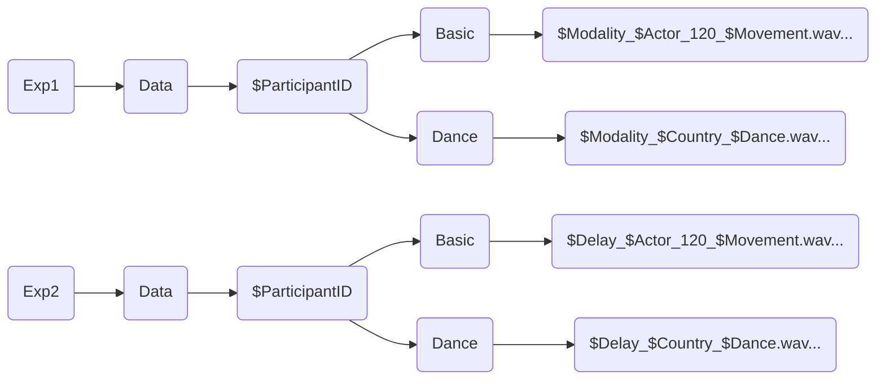

## Introduction
Analysis process used on data collected for the MuMo Stimuli set validation.

## Data Structure
Data is made up of one stereo recording for each trial made by the participant. The right channel contains the microphone's recording of participant's response, the left channels contains  the computer's audio, recorderd through an hardware feedback loop.

The data folder is structured as follows:


## Extraction Script
The first part of the analysis consisted in the extraction of participant's claps. This was not a trivial task, since participants were quite varied in their volume and relationship with the stimulus' periodicity.

### Proper Extraction
The proper extraction of claps was done through the <code>findpeaks()</code> function in Matlab. 
Before that a (somewhat haphazard) compression was applied to the response's channel:
```matlab
    noiseFloor    = 0.001; 
    comprThreshold= 0.2;
    comprGain     = 100;
    threshold     = 0.005;
    minInterval   = 0.1;

    responseChannel(abs(responseChannel) < noiseFloor) = 0; 
    low_idx2 = abs(responseChannel) < comprThreshold;
    responseChannel(low_idx2) = responseChannel(low_idx2) * comprGain;
    responseChannel = responseChannel * (0.9 / max(abs(responseChannel)));
```

After this, the actual extraction was performed:
```matlab
    min_pk_dist = fs*0.05; %50 ms
    min_pk_prom = 0.03;
    min_pk_height = 0.025;

    %Find peaks response
    [peak_amp, locs] = findpeaks(responseChannel, ...
        'MinPeakDistance', min_pk_dist, ... 
        'MinPeakProminence', min_pk_prom, ...
        'MinPeakHeight', min_pk_height); 
    locs = round(locs/fs*1000, 1);

    i_sorted = 2;
    responseFilteredTimes = locs(1);
    peak_amp_sorted = peak_amp(1);
     
    for i_clap = 2:length(locs)
        
        delta = locs(i_clap) - locs(i_clap-1);
        
        if delta > 250 % arbitrary time constant 
            responseFilteredTimes(i_sorted) = locs(i_clap);
            peak_amp_sorted(i_sorted) = peak_amp(i_clap);
            i_sorted = i_sorted +1;
        end
    end
```

Each stimulus featured a control tone at exactly 2.0 sec. This was added as a way to exactly align every trial, since the start of each recording was slightly different.

The control tone offset for each trial is calculated before performing the manual onset correction but the actual shifting is performed later, since applying the shift before the manual correction broke the manual correction.

```matlab
    %% control tone alignment
    % first stimulus peak
    if isempty(stimulusFilteredTimes)
        error('No peak found in stimulus channel.');
    end
    firstStimulusPeak = stimulusFilteredTimes(1);
    
    % control tone decl
    expectedControlTime = 2000;
    
    % offset calc
    offset_ms = firstStimulusPeak - expectedControlTime;
    
    [MANUAL ONSET CORRECTION]

    % Align response
    responseAlignedTimes = responseFilteredTimes - offset_ms;
    
    stimAlignedTimes = stimulusFilteredTimes - offset_ms;
```
### Tabulation of Extracted Claps
The analysis will focus on two measures: **stability** and **accuracy**. <br>
By **stability**, I refer to the consistency of a participant’s rhythmic production across time. Stability is quantified as the standard deviation of the inter-response intervals (IRIs), with lower values indicating more regular and stable performance.<br>
By **accuracy**, I refer to the degree to which a participant’s responses are temporally aligned with the stimulus. Accuracy is quantified as the temporal difference (asynchrony) between each response and the corresponding stimulus onset, with values closer to zero indicating greater synchrony.<br>
Whereas stability can be calculated only using the response channel, accuracy necessarily requires consideration of the stimulus timing as well. 

#### Stability (or RAW Analysis)
The stability workspace has been set up by creating a CSV containing the extracted response claps. An early calculation of the IRIs has also been added into this CSV, allowing for easier data handling.<br>

Since the variable names have been lost in some part of the process, let it be known that Var1 represent Participant ID and Var6 represents the offset (calculated from the control tone). 
Furthermore, Latency_Check represents the difference between the hard-coded stimulus time series (calculated by applying the findpeaks() function to the actual stimuli) and the stimulus time series coming from the left channel of the recording. Since some external devices were used for the data collection (USB Hub for Mac, External Monitor, Scarlett Focusrite 2i2) this measure was put in place to make sure that there were no hiccups in the stimulus shown.<br>

{: width="700" height="400" }

It can be noted that Stimulus_Times and Response_Times do not align, that's because we are not interested in that for the calculation of stability.


#### Accuracy (or GRID Analysis)
In order to calculate the asynchrony between the participant's response and the stimulus, we need to connect every participant's clap to a stimulus' onset. This is fairly easy to do when the participant is clearly entrained with the stimulus' periodicity, but represents more of a challenge when that's not the case. <br>
I defined a 360ms window around each stimulus' onset (+180ms, -180ms, stimulus' onset is in the middle). For the GRID analysis, every response that fell inside this window was kept in the file, everything outside of it was not considered. An additional row with the asynchronies (Relative_Time) was added to the CSV.

{: width="700" height="400" }


## Statistical Analysis

### RAW Analysis

#### CSV Cleanup and Preparation
The RAW CSV has been prepared by removing everything except for the Interclap_Interval row. A hard threshold has been set at 1250ms, removing every response above that value. This has been done since it was common for participant to clap once at the start of the trial, then wait a bit and eventually resume. This also happened when the participant re-oriented themselves, missing three or more beats. As confirmation of this, the vast majority of values have been removed from the first place in the series of IRI. <br>
After this, the variable containing the stimulus' filename has been divided into its different parts and turned into different factors (Actor, Movement, Modality.).
Before working on the plot, the second peak of distribution around 1000ms has to be addressed. 
{: width="700" height="400" }

This is a density plot of every ICI in the dataset. Since every basic movement was performed at 120BPM, we can assume that participants have tried to synchronize with a 500ms or 1000ms rate. Since keeping the distribution around the 1000ms mark leads to misleading plots, the current (temporary) solution is to have another hard threshold at 900ms.

#### Plots
Keep in mind that every plot has been done with the 900ms threshold.
{: width="700" height="400" }
{: width="700" height="400" }
{: width="700" height="400" } <br>

For the actor plots:
{: width="700" height="400" }
{: width="700" height="400" }


#### Circular Plots

{: width="700" height="400" } <br>

A few tentative steps have been moved towards the circular statistics approach. Every trial has been plotted in this way and is accessible should we decide to develop this approach more. I stitched bits and pieces of code from around the internet and AI, and my code does not seem to get along well with half-time claps, even though Manu says it should be able to handle it. I'll try to look more into it.
As a side note, "virtual clap" is the method I'm using now to handle half time claps. The way it works is by adding a fake clap in the missing beat, in order to avoid the plot breaking down. This is absolutely temporary while I find the true solution.

#### Numbers!

Okay so keep in mind two things: (1)the 900ms threshold is still in place, (2) I'm 0% sure of what follows. It's been a while since my stat exams and what is here is only thanks to Manu kindly providing the script he uses for these kinds of analysis.

For the analysis I'm using the SD of ICIs as measure. Don't know if it's the right way to do it but here we go.<br>
After the data setup I checked for Skewness and Kurtosis of the Standard Deviations. As a clarification, I used the mean SD for each trial.
{: width="700" height="400" }
<br>
Here is the density distribution for the SD means.
{: width="700" height="400" } <br>


After this I built the model upon which the assumptions will be tested. 

```r
model <- lmer(as.formula(paste("deviazione", "~ modality * movement + (1 | V1)")), data = data_file, na.action = 'na.omit') #+ (1 | participant)
check_normality(model)
check_heteroscedasticity(model)
check_model(model)
```

Both normality and heteroscedasticity failed and were found with p < .001 <br>
<span style="color:red">Warning: Non-normality of residuals detected (p < .001).<br>
Warning: Heteroscedasticity (non-constant error variance) detected (p < .001).</span>.

Check_model gave this as output:
{: width="700" height="400" } <br>

After this, Manu's script goes into outliers management:

```r
# ------ Identify outliers
check_outliers(model, method = "zscore")


# ------ Deal with outliers
backup = data_file

probs_min = 0
probs_max = 0.995

data_file[["deviazione"]] <-
  Winsorize(data_file[["deviazione"]], 
            val = quantile(data_file[["deviazione"]], probs = c(probs_min, probs_max), na.rm = T))
  

# depending on the version of the packages, this following code sometimes works better
# 
# Print modified rows
changed_rows <- data_file[["deviazione"]] != backup[["deviazione"]]

changed_rows_number <- which(changed_rows)
```

8 Outliers were found and corrected (again, keep in mind the 900ms threshold):

```plaintext
Outliers per variable (zscore): 

$deviazione
    Row Distance_Zscore
98   98        5.259674
256 256        6.502398
426 426        3.908429
430 430       11.194245
455 455        3.487668
456 456        3.749230
457 457        4.433291
531 531        4.192687
```

After this, Manu's script checks again for normality and homoscedasticity, which fail again.
{: width="700" height="400" } <br>

Since assumptions are not met, I proceed with GLM instead of ANOVA.

```r
anova(model, type = 3) 
effectsize::eta_squared(model)
```

```plaintext
>   anova(model, type = 3) 

Type III Analysis of Variance Table with Satterthwaite's method
                   Sum Sq Mean Sq NumDF  DenDF F value    Pr(>F)    
modality           334.41  167.21     2 544.67  3.1945 0.0417555 *  
movement           632.35  316.18     2 543.81  6.0406 0.0025428 ** 
modality:movement 1063.35  265.84     4 543.81  5.0789 0.0005036 ***
---
Signif. codes:  0 ‘***’ 0.001 ‘**’ 0.01 ‘*’ 0.05 ‘.’ 0.1 ‘ ’ 1

>   effectsize::eta_squared(model)

# Effect Size for ANOVA (Type III)

Parameter         | Eta2 (partial) |       95% CI
-------------------------------------------------
modality          |           0.01 | [0.00, 1.00]
movement          |           0.02 | [0.00, 1.00]
modality:movement |           0.04 | [0.01, 1.00]

- One-sided CIs: upper bound fixed at [1.00].
```

Post-hocs:

```r
# GLM - Estimated Marginal Means
emmeans(model, ~ movement*modality, adjust = "bonferroni")
contrast(emmeans(model, ~ movement*modality, adjust = "bonferroni"))
```
```plaintext
>   emmeans(model, ~ movement*modality, adjust = "bonferroni")
movement modality emmean   SE  df lower.CL upper.CL
Clap     A          22.0 1.12 274     18.8     25.1
Jump     A          25.5 1.12 274     22.3     28.6
Step     A          22.2 1.12 274     19.1     25.3
Clap     AV         23.0 1.12 274     19.8     26.1
Jump     AV         24.8 1.13 278     21.6     27.9
Step     AV         22.7 1.13 278     19.6     25.9
Clap     V          22.5 1.12 271     19.4     25.6
Jump     V          24.4 1.12 271     21.2     27.5
Step     V          27.8 1.12 274     24.7     31.0

Degrees-of-freedom method: kenward-roger 
Confidence level used: 0.95 
Conf-level adjustment: bonferroni method for 9 estimates 
>   contrast(emmeans(model, ~ movement*modality, adjust = "bonferroni"))
contrast       estimate    SE  df t.ratio p.value
Clap A effect    -1.888 0.821 543  -2.299  0.0985
Jump A effect     1.588 0.821 543   1.933  0.1209
Step A effect    -1.657 0.821 543  -2.017  0.1209
Clap AV effect   -0.889 0.821 543  -1.083  0.3148
Jump AV effect    0.895 0.827 544   1.082  0.3148
Step AV effect   -1.121 0.827 544  -1.355  0.2640
Clap V effect    -1.370 0.817 545  -1.677  0.1696
Jump V effect     0.494 0.817 545   0.604  0.5460
Step V effect     3.949 0.821 543   4.808 <0.0001

Degrees-of-freedom method: kenward-roger 
P value adjustment: fdr method for 9 tests 
```

### GRID Analysis

#### CSV Cleanup and Preparation
For the cleanup of GRID files no outlier threshold was needed, since that already happens in the extractions script (+-180ms from the stimulus onset).
The same process of stimulus namefile's division into different factors took place. The measure used is mean asynchrony with the stimulus, calculated for each trial.

#### Plots
{: width="700" height="400" }
{: width="700" height="400" }
{: width="700" height="400" } <br>

For the actor plots:
{: width="700" height="400" }
{: width="700" height="400" }

#### Numbers!
The analysis script is the same, therefore I'll follow the same process as before.
{: width="700" height="400" } <br>

{: width="700" height="400" } <br>

```r
model <- lmer(as.formula(paste("mean", "~ modality * movement + (1 | V1)")), data = data_file) #+ (1 | participant)

check_normality(model)
check_heteroscedasticity(model)
check_model(model)
```

Both normality and heteroscedasticity failed and were found with p < .001 <br>
<span style="color:red">Warning: Non-normality of residuals detected (p < .001).<br>
Warning: Heteroscedasticity (non-constant error variance) detected (p < .001).</span>.

Check_model gave this as output:
{: width="700" height="400" } <br>

6 Outliers were found and corrected:

```plaintext
Outliers per variable (zscore): 

$mean
    Row Distance_Zscore
106 106        3.351089
126 126        3.731540
224 224        3.439290
225 225        3.440006
277 277        3.607660
295 295        3.671900
```

After this, check_model gave:
{: width="700" height="400" } <br>


```plaintext
>   anova(model, type = 3) 
Type III Analysis of Variance Table with Satterthwaite's method
                  Sum Sq Mean Sq NumDF DenDF  F value    Pr(>F)    
modality          343787  171893     2   552 219.3406 < 2.2e-16 ***
movement           33761   16881     2   552  21.5403 9.823e-10 ***
modality:movement   4913    1228     4   552   1.5672    0.1816    
---
Signif. codes:  0 ‘***’ 0.001 ‘**’ 0.01 ‘*’ 0.05 ‘.’ 0.1 ‘ ’ 1
>   effectsize::eta_squared(model)
# Effect Size for ANOVA (Type III)

Parameter         | Eta2 (partial) |       95% CI
-------------------------------------------------
modality          |           0.44 | [0.39, 1.00]
movement          |           0.07 | [0.04, 1.00]
modality:movement |           0.01 | [0.00, 1.00]

- One-sided CIs: upper bound fixed at [1.00].
```


Post-Hoc:

```plaintext
>   emmeans(model,  ~ movement*modality, adjust = "bonferroni")
 movement modality emmean   SE  df lower.CL upper.CL
 Clap     A        -31.89 3.76 463    -42.4   -21.42
 Jump     A        -17.50 3.76 463    -28.0    -7.04
 Step     A        -25.63 3.76 463    -36.1   -15.16
 Clap     AV       -23.92 3.76 463    -34.4   -13.46
 Jump     AV        -7.79 3.76 463    -18.3     2.68
 Step     AV        -8.84 3.76 463    -19.3     1.63
 Clap     V         15.67 3.76 463      5.2    26.13
 Jump     V         34.18 3.76 463     23.7    44.64
 Step     V         38.01 3.76 463     27.5    48.47

Degrees-of-freedom method: kenward-roger 
Confidence level used: 0.95 
Conf-level adjustment: bonferroni method for 9 estimates 
>   contrast(emmeans(model,  ~ movement*modality, adjust = "bonferroni"))
 contrast       estimate   SE  df t.ratio p.value
 Clap A effect    -28.81 3.15 552  -9.132 <0.0001
 Jump A effect    -14.42 3.15 552  -4.572 <0.0001
 Step A effect    -22.55 3.15 552  -7.148 <0.0001
 Clap AV effect   -20.84 3.15 552  -6.608 <0.0001
 Jump AV effect    -4.71 3.15 552  -1.493  0.1361
 Step AV effect    -5.76 3.15 552  -1.826  0.0770
 Clap V effect     18.75 3.15 552   5.943 <0.0001
 Jump V effect     37.26 3.15 552  11.810 <0.0001
 Step V effect     41.09 3.15 552  13.024 <0.0001

Degrees-of-freedom method: kenward-roger 
P value adjustment: fdr method for 9 tests 
```


## Considerations
Sorry if the analysis section is still a bit unclear and probably not entirely correct. I’d be very happy to hear suggestions on how to improve or fix it.

I have a few questions:
- By including (1 \| V1) in the model, I’m technically adding participants as a factor. Since this is a repeated-measures design, where each participant appears multiple times, is this an appropriate way to model it?
- Manu and I discussed the possibility of applying a log transformation to the data, especially to the SD measures. I haven’t applied it yet, but I have the feeling that it might be necessary, so I’ll try that next.
- More generally: these data **should** be normally distributed, right?
I feel that once I get a clear overall picture of how to handle the data, the rest of the experiments should be fairly easy to analyze. Exp 2 Basic is essentially the same analysis, with the added aspect of monitoring the delay. Exp 1 / Exp 2 Dance should be mostly fine as long as participants stuck to an isochronous pulse. The GRID analysis should be easier, since I already have the time series. The RAW analysis will be more troublesome because participants were not aiming for a stable BPM. In that case, would it make sense to focus only on accuracy for the dance conditions?