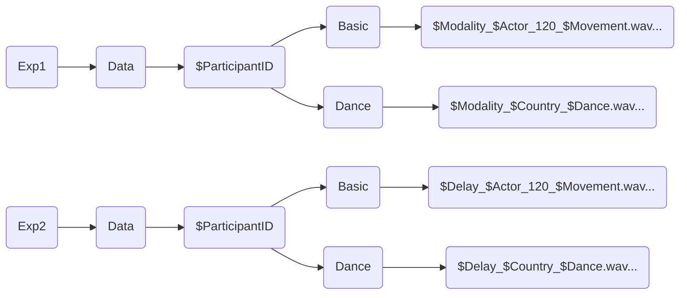

## Introduction
Analysis process used on data collected for the MuMo Stimuli set validation.

## Data Structure
Data is made up of one stereo recording for each trial made by the participant. The right channel contains the microphone's recording of participant's response, the left channels contains  the computer's audio, recorderd through an hardware feedback loop.



## Extraction Script
The first part of the analysis consisted in the extraction of participant's claps. This was not a trivial task, since participants were quite varied in their volume and relationship with stimulus' periodicity. A couple of problems thus emerged, one regarding the actual extraction of peaks and another regarding the relationship between stimulus and response.

### Proper Extraction
The proper extraction of claps was done through the <code>findpeaks()</code> function in Matlab. 
Before that a (somewhat haphazard) compression was applied to the response's channel:
```matlab
    noiseFloor    = 0.001; 
    comprThreshold= 0.2;
    comprGain     = 100;
    threshold     = 0.005;
    minInterval   = 0.1;

    responseChannel(abs(responseChannel) < noiseFloor) = 0; 
    low_idx2 = abs(responseChannel) < comprThreshold;
    responseChannel(low_idx2) = responseChannel(low_idx2) * comprGain;
    responseChannel = responseChannel * (0.9 / max(abs(responseChannel)));
```

After this, the actual extraction was performed:
```matlab
    min_pk_dist = fs*0.05; %50 ms
    min_pk_prom = 0.03;
    min_pk_height = 0.025;

    %Find peaks response
    [peak_amp, locs] = findpeaks(responseChannel, ...
        'MinPeakDistance', min_pk_dist, ... 
        'MinPeakProminence', min_pk_prom, ...
        'MinPeakHeight', min_pk_height); 
    locs = round(locs/fs*1000, 1);

    i_sorted = 2;
    responseFilteredTimes = locs(1);
    peak_amp_sorted = peak_amp(1);
     
    for i_clap = 2:length(locs)
        
        delta = locs(i_clap) - locs(i_clap-1);
        
        if delta > 250 % arbitrary time constant 
            responseFilteredTimes(i_sorted) = locs(i_clap);
            peak_amp_sorted(i_sorted) = peak_amp(i_clap);
            i_sorted = i_sorted +1;
        end
    end
```

Each stimulus featured a control tone at exactly 2.0 sec. This was added as a way to exactly align every trial, since the start of each recording was slightly different.

The offset is calculated before performing the manual onset correction but the actual shifting is performed later, since applying the shift before the manual correction broke the script.

```matlab
    %% control tone alignment
    % first stimulus peak
    if isempty(stimulusFilteredTimes)
        error('No peak found in stimulus channel.');
    end
    firstStimulusPeak = stimulusFilteredTimes(1);
    
    % control tone decl
    expectedControlTime = 2000;
    
    % offset calc
    offset_ms = firstStimulusPeak - expectedControlTime;
    
    [MANUAL ONSET CORRECTION]

    % Align response
    responseAlignedTimes = responseFilteredTimes - offset_ms;
    
    stimAlignedTimes = stimulusFilteredTimes - offset_ms;
```
### Interpretation of Extracted Claps
The analysis will use two main values: stability and accuracy. <br>
By **stability** I mean the measure of how *stable* the participant is, as in Standard Deviation of the Inter-Response Interval. <br>
By **accuracy** I mean the measure of how much the participant's response is *in phase* with the stimulus. This is calculate through the difference between the response and the stimulus. <br>
Whereas stability is easily calculated by only considering the response channel, accuracy needs to consider the stimulus as well. Since considering the stimulus requires additional considerations, I'll start with the stability.

#### Stability (or RAW Analysis)
The stability workspace has been set up by creating a CSV containing the extracted response claps.
{: width="700" height="400" }


#### Accuracy (or GRID Analysis)
The accuracy workspace
{: width="700" height="400" }


## Statistical Analysis

### CSV Cleanup and Preparation
### Plots
### Circular Plots
### RAW Analysis
### GRID Analysis